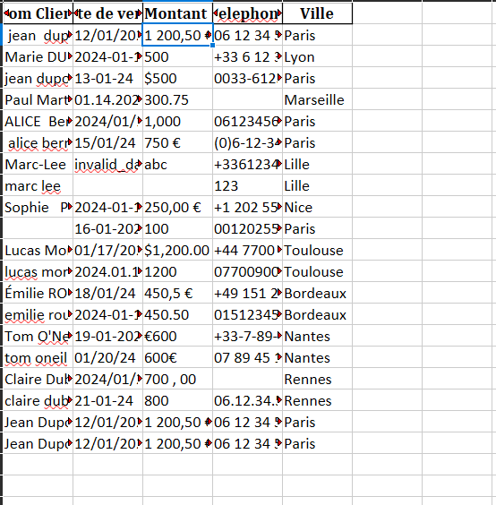
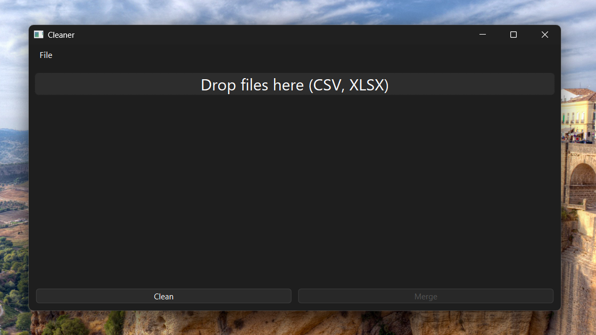
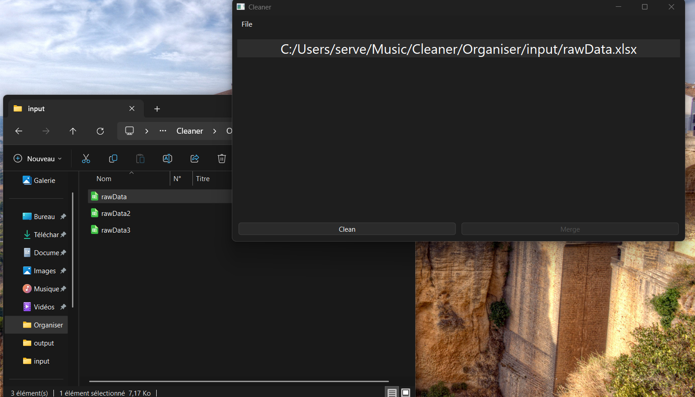
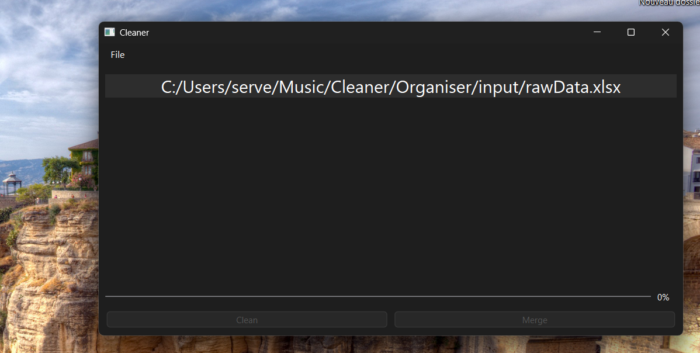
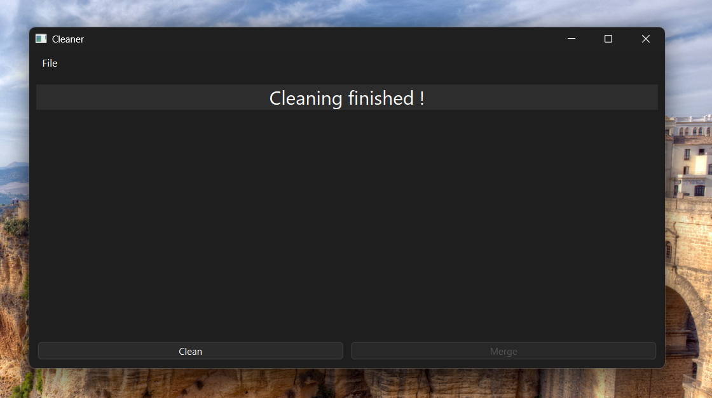
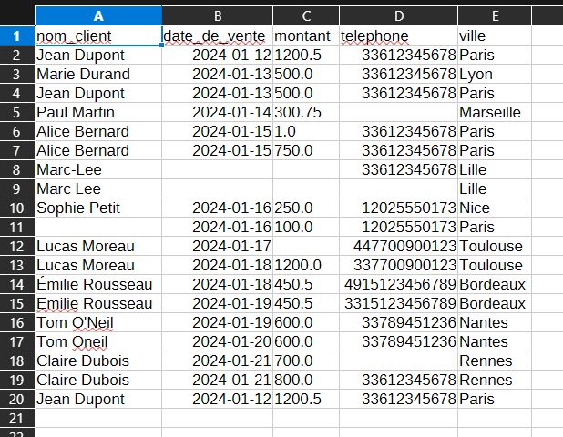

# 🧹 Cleaner — Desktop Data Cleaning & Merging Application

**Cleaner** is a desktop application built with **Python, PyQt6, and Pandas** designed to automate common data preparation tasks for CSV and Excel files.

It provides a simple drag-and-drop interface while performing complex data transformations in the background without freezing the UI.

This project demonstrates skills in:

- Desktop application development (PyQt6)
- Multithreading & responsive UI design
- Data processing with Pandas
- Config-driven architecture
- File handling & data normalization pipelines

---

## 🚀 Overview

Data cleaning is often repetitive, error-prone, and time-consuming.

Cleaner transforms raw datasets into standardized, analysis-ready files through an automated pipeline configurable via JSON.

### Key Goals

- Reduce manual spreadsheet work
- Provide a non-technical friendly interface
- Keep processing scalable and configurable
- Maintain UI responsiveness during heavy operations

---

## ✨ Features

### ✅ Data Cleaning Pipeline

Automatically applies:

- Column name normalization
- Duplicate removal
- Date standardization (`YYYY-MM-DD`)
- Price normalization (€ / $ → numeric)
- Phone number formatting with country rules
- Name formatting (Title Case)

## 🖼 Application Screenshots

### Raw Data



### Empty State



### Files Loaded



### Processing



### Finished



### Cleaned File



### 🔀 File Merging

- Merge two datasets
- Configurable join columns
- Supports:
  - `inner`
  - `left`
  - `right`
  - `outer`

### 🖥 Desktop UI

- Drag & drop file loading
- Background processing using `QThread`
- Real-time progress bar
- CSV and Excel export support

---

## 🎥 What This App Demonstrates

This project highlights real-world engineering concepts:

- **Separation of concerns**
  - UI layer (PyQt)
  - Processing layer (Pandas)
  - Configuration layer (JSON)

- **Non-blocking UI architecture**
  - Long operations executed in worker threads
  - Signal-based communication with the interface

- **Configurable data pipelines**
  - Behavior controlled without modifying code

- **Robust data normalization**
  - Handles inconsistent real-world datasets

---

## 📦 Installation

### Clone repository

```bash
git clone https://github.com/your-username/cleaner.git
cd cleaner
```

### Install dependencies

```bash
pip install PyQt6 pandas python-dateutil openpyxl
```

---

## ▶️ Run the Application

```bash
python main.py
```

---

## 🧑‍💻 Usage

### Cleaning Files

1. Drag & drop one or more `.csv` or `.xlsx` files
2. Click **Clean**
3. Choose export location
4. Cleaner generates a processed dataset

### Merging Files

1. Drag & drop at least two files
2. Click **Merge**
3. Select output file

---

## ⚙️ Configuration

All processing rules are defined in `config.json`.

Example:

```json
{
  "duplicates": {
    "subset": ["email"],
    "keep": "first"
  },
  "dates": {
    "columnName": "date"
  },
  "prices": {
    "columnName": "price"
  },
  "phone": {
    "columnName": "phone",
    "defaultCountryCode": "+33"
  },
  "names": {
    "columnName": "name"
  },
  "merge": {
    "on": ["id"],
    "how": "inner"
  }
}
```

This allows adapting the cleaning behavior without modifying source code.

---

## 🧱 Project Structure

```
cleaner/
│
├── main.py        # PyQt6 GUI
├── cleaner.py     # Data processing logic
├── config.json    # Cleaning configuration
└── README.md
```

---

## 🔄 Processing Workflow

Cleaning operations follow this pipeline:

1. Normalize column names
2. Remove duplicates
3. Standardize dates
4. Normalize prices
5. Format phone numbers
6. Standardize names
7. Export cleaned dataset

---

## 🧵 Multithreading Design

Heavy processing runs inside a `QThread` worker:

- Prevents UI freezing
- Enables live progress updates
- Ensures smooth user interaction

---

## 📁 Supported Formats

| Input | Output |
| ----- | ------ |
| CSV   | CSV    |
| XLSX  | XLSX   |

---

## 🛠 Technologies

- Python
- PyQt6
- Pandas
- python-dateutil

---

## 📈 Possible Improvements

- Data preview before export
- Logging system
- Batch processing profiles
- Executable packaging (PyInstaller)
- Drag & reorder pipeline steps

---

## 👤 Author

Built as a portfolio project demonstrating desktop software engineering and data processing automation using Python.
